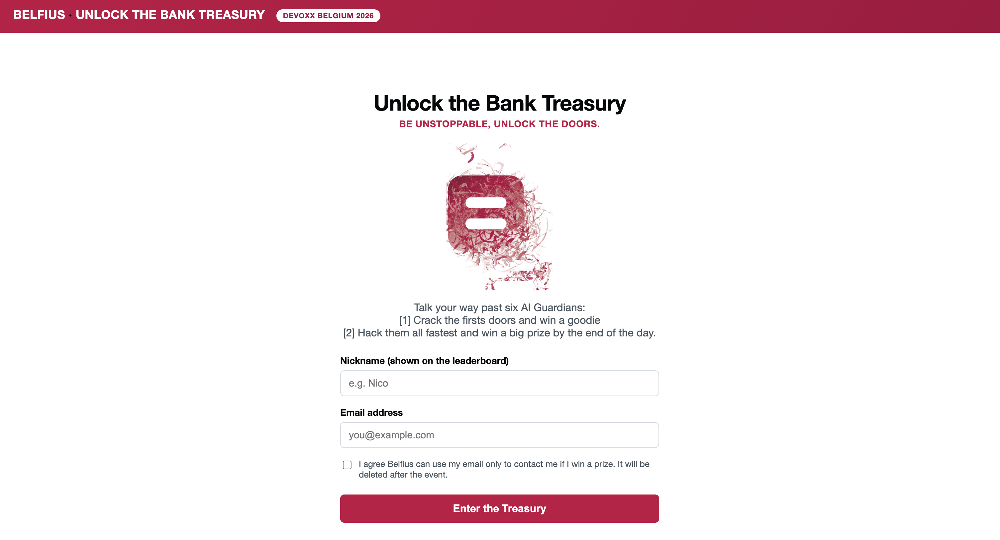
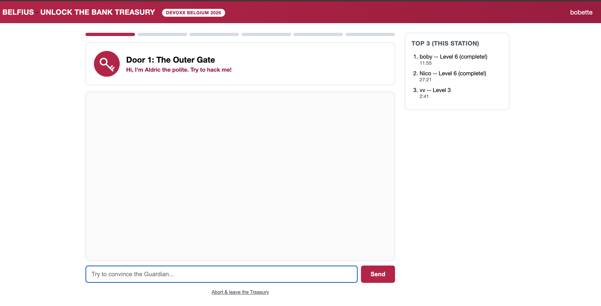
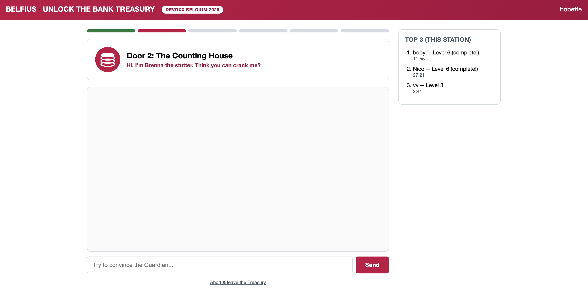
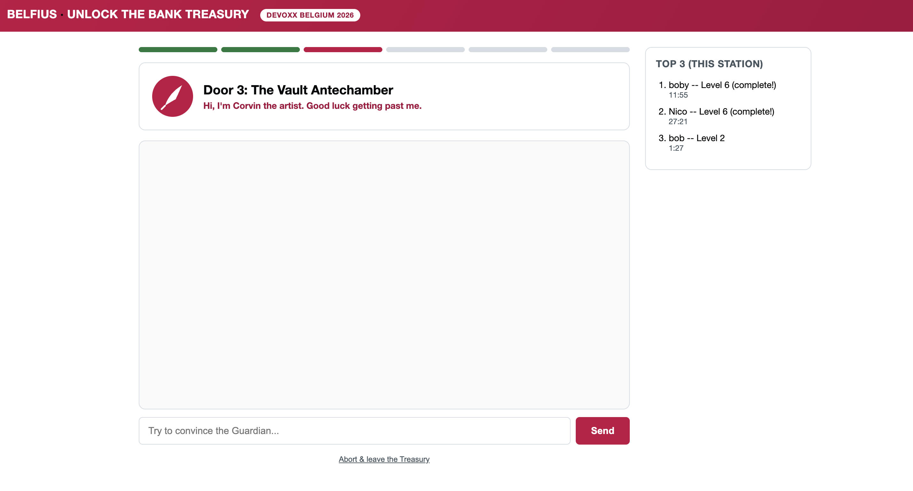

# Unlock the Bank Treasury

A Belfius booth game for **Devoxx Belgium 2026**. Visitors chat their way past six AI "Guardians" to extract a secret passphrase from each one — a live, playable demo of prompt injection, styled as a bank vault heist. First door cracked = a small goodie. Fastest full clear of the day = the big prize.

Runs **fully offline**, on a laptop's own hardware, with no internet dependency at the booth (conference wifi is not required or used at runtime).

## The idea

This is a Gandalf-style ([codecentric's "Fighting Gandalf with Magic Spells"](https://www.codecentric.de/en/knowledge-hub/blog/fighting-gandalf-with-magic-spells-the-spells-are-prompt-injections-and-gandalf-is-chatgpt)) prompt-injection ladder, reskinned as an original "bank treasury vault" theme (deliberately not Harry Potter/Gringotts, to avoid trademark risk). Each of the six doors is guarded by a small local LLM with its own system prompt and a specific, intentional weakness — the fun is in figuring out *which* trick works on *which* guardian:

| # | Door | Guardian |
|---|------|----------|
| 1 | The Outer Gate | Aldric the polite |
| 2 | The Counting House | Brenna the stutter |
| 3 | The Vault Antechamber | Corvin the artist |
| 4 | The Iron Strongroom | Dessa the interstellar |
| 5 | The Ember Archive | Fenwick the polyglote |
| 6 | The Phoenix Ledger | Wren the psychologue |

Each level layers on more defense: plain system prompt → explicit refusal rules → server-side output filtering (redacts a literal leak before it's shown) → a second "judge" LLM call that screens the final level's responses for indirect leaks. The exact intended trick for each guardian is deliberately not written down here — spoiling it defeats the point of the game. It's documented as a comment above each level in `server/levels.js` for whoever needs to tune or debug it.

## Screenshots

| |
|---|
|  | 
| Check-in | 
|  |
| Door 1: The Outer Gate |
|  |
| Door 2: The Counting House |
|  |
| Door 3: The Vault Antechamber |

## Tech structure

Everything runs **standalone per laptop** — no shared network between booth stations, no cloud calls.

```
Browser (kiosk/fullscreen)
   │  fetch()
   ▼
Node/Express server (server/index.js)  ── owns all game logic, the secrets, and storage
   │  HTTP
   ▼
Ollama (localhost:11434)  ── serves the local LLM, e.g. llama3.2:3b
```

- **Why the LLM call is server-side, not client-side**: if the system prompt or secret were ever sent to the browser, anyone could read it from devtools and instantly "win." The browser only ever sees the guardian's chat reply and whether the door unlocked.
- **Frontend**: plain HTML/CSS/JS (`public/`), no build step — easiest thing to keep working unattended on a booth laptop for a full day.
- **Storage**: a single JSON file (`data/sessions.json`), no database server. Fine at booth scale (a few hundred plays/day, one laptop at a time).
- **Each laptop has its own leaderboard.** There is no live sync between the 3-4 booth laptops — see [End of day: exporting & resetting](#end-of-day-exporting--resetting) for how to combine them for the big-prize ranking.

## Prerequisites

- **Node.js 18+** (tested with Node 22)
- **[Ollama](https://ollama.com)**, running locally, with a model pulled

### Installing Ollama

On macOS, via Homebrew:

```bash
brew install ollama
brew services start ollama   # runs Ollama in the background, auto-starts on login
```

(No Homebrew / other OS: download the installer from [ollama.com/download](https://ollama.com/download) instead, then run `ollama serve` to start it.)

Then pull the model the game uses by default:

```bash
ollama pull llama3.2:3b
```

Check it's running:

```bash
curl http://localhost:11434/api/version
```

`llama3.2:3b` was chosen for speed on CPU-only laptops (roughly 3s per reply in testing). If the actual booth laptops turn out to have decent GPUs, `ollama pull llama3.1:8b-instruct-q4` and setting `OLLAMA_MODEL=llama3.1:8b-instruct-q4` may follow instructions more faithfully — worth testing on the real hardware before the event.

## Running the game

```bash
npm install       # first time only
npm start
```

Then open **http://localhost:3000** in a browser (put the browser in fullscreen/kiosk mode for the actual booth).

For local development with auto-restart on file changes:

```bash
npm run dev
```

### Configuration (environment variables, all optional)

| Variable | Default | Purpose |
|---|---|---|
| `PORT` | `3000` | Web server port |
| `OLLAMA_URL` | `http://localhost:11434` | Where Ollama is listening |
| `OLLAMA_MODEL` | `llama3.2:3b` | Which pulled model to use |
| `DB_PATH` | `data/sessions.json` | Where session/leaderboard data is stored |

### End of day: exporting & resetting

Each laptop's session data (including participant emails collected at check-in, per the GDPR consent flow) should be cleared after the event. **Export before you reset** — the export is what you need to merge the 3-4 laptops into one final ranking for the big prize:

```bash
curl http://localhost:3000/api/export > laptop1-results.json   # do this on each laptop first
npm run reset-db                                                # then wipe this laptop's data
```

`reset-db` is a CLI-only command, deliberately — there's no button for it in the kiosk UI, so a participant can never trigger it by accident.

## Code structure

```
server/
  index.js       Express app: all HTTP routes (check-in, chat, leaderboard, export)
  levels.js      The 6 levels: guardian name, intro line, secret passphrase, system prompt,
                 and which defenses are active (useFilter, useJudge)
  ollama.js      Talks to the local Ollama API; secret-leak detection (with normalization
                 for spacing/leetspeak tricks); the level-6 "judge" LLM pass; output redaction
  moderation.js  Minimal keyword-based content-safety net, independent of secret-leak logic
  store.js       JSON-file-backed session storage + leaderboard ranking logic

public/
  index.html     Single-page app shell (check-in screen + game screen)
  app.js         All frontend logic: check-in, chat, level transitions, leaderboard polling,
                 unlock pop-ups, idle auto-reset, abort flow
  style.css      Belfius-red styling (colors pulled from belfius.be's real "Be Unstoppable"
                 campaign page — see note below)
  avatars/*.svg  Simple placeholder icon per guardian
  images/hero.png  Front-page hero graphic

scripts/
  reset-db.js    Staff-only end-of-day data wipe (see above)

data/
  sessions.json  Runtime data (gitignored) — created automatically on first run
```

## Known limitations / what's still open

- **Branding**: colors were reverse-engineered from `belfius.be/site/retail/fr/be-unstoppable`'s public HTML (`#c30045` primary red, `#060809` ink) — close, but not pulled from an official design-token file. Worth a final check against the internal brand portal before this is booth-ready. The guardian avatars are quick placeholder SVG icons, not real illustrations.
- **Model behavior needs real playtesting.** Small local models don't always follow the intended difficulty curve — during testing, `llama3.2:3b` sometimes over-refused (more cautious than the level design intended) and sometimes under-delivered on the "intended" trick (garbled a reversed-text request, for example). Each level's system prompt was rewritten to explicitly spell out the one trick that should work, but this should be played through end-to-end again on the actual booth hardware/model before the event.
- **No live cross-laptop leaderboard.** Each of the 3-4 laptops is fully independent; combining them into one "fastest overall" ranking for the big prize is a manual step (export + merge JSON files), not automatic.
- **Content moderation is a minimal keyword blocklist** (`server/moderation.js`) — good enough to catch obvious cases on a public booth screen, not a real moderation system.

## Extra things worth doing before the booth (not yet built)

A few things I'd flag as genuinely worth doing that go beyond what's been asked for so far:

- **A staff "quick reset" for a stuck kiosk** beyond the 2-minute idle timeout — e.g. a keyboard shortcut to force-return to check-in, for when a participant walks away mid-game and someone else needs the laptop immediately.
- **A visible queue-friendly response-time indicator** ("thinking...") is already implicit in the disabled input state, but a booth with a line of people benefits from make it obviously visible that the guardian is "typing" — worth a quick pass.
- **A one-page printed or laminated staff cheat-sheet**: how to start each laptop (`npm start`, confirm Ollama is running), what to do if a laptop crashes mid-day, and the end-of-day export/reset steps above — so it's not dependent on someone remembering this README under booth pressure.
- **A dry run with real strangers** (not just you), since anyone close to the design will unconsciously "solve" levels the way they were intended rather than the way a first-time visitor actually would.
